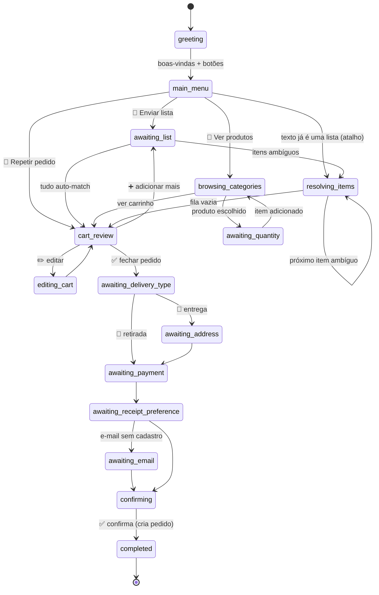

# Fluxo conversacional — QuickCart

Máquina de estados persistida em `conversation_sessions.current_state`.
Tabela completa de estados/handlers: `.specs/features/mvp/spec.md` §4.

## Regras transversais

- `GlobalHandler` roda antes de qualquer estado: `sair`/`cancelar` → reset p/ `greeting`.
- **Atalho de velocidade**: em `greeting`/`main_menu`, se o texto parseia ≥ 2 itens, pula o
  menu e trata como lista — o cliente que manda a lista de cara nunca vê menu.
- **Áudio** em qualquer estado de captura de lista: job `stt` na fila; bot responde
  "🎧 ouvindo seu áudio..."; transcript reentra pelo `POST /v1/internal/conversation/resume`.
- **Desambiguação**: 1 item por vez (lista interativa Meta, máx 10 rows + "❌ Nenhum desses").
  Ids das rows: `product:<uuid>` e `skip_item`.
- Sessão sem interação por 6h → próximo contato recomeça em `greeting` (contexto limpo,
  carrinho `open` preservado — oferece "continuar de onde parou" se houver itens).
- Toda mensagem (in/out) persiste em `messages`; textos do bot só em `Messages.constant.ts`.

## Exemplo canônico (caso de aceite da Fase 4)

Cliente: `2kg arroz, leite, 6 ovos, sabão`
1. ovos → match único confiante → auto (6 un)
2. arroz → 3 candidatos → lista interativa (Tio João 1kg · Camil 1kg · Integral 1kg)
3. leite → 4 candidatos → lista interativa
4. sabão → 3 candidatos → lista interativa
5. Resumo: itens + subtotal + botões ✅ Fechar pedido / ➕ Adicionar / ✏️ Editar
