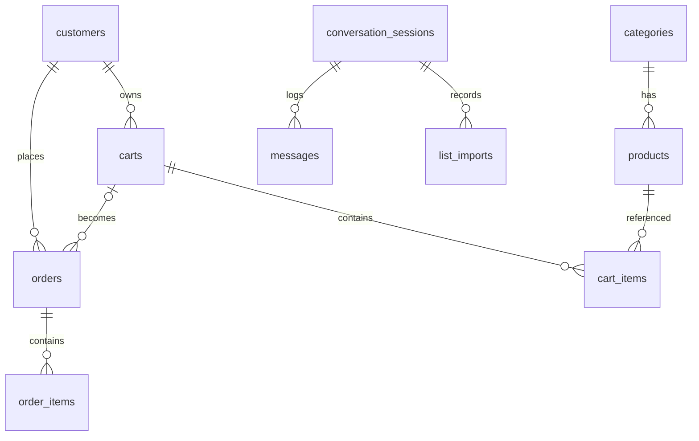

# Database — QuickCart

Postgres + Drizzle. Detalhe completo das colunas: `.specs/features/mvp/spec.md` §2.
Convenções: PK uuid v7, `varchar` no lugar de enum de banco, timestamps `timestamptz`.

## Diagrama

## Pontos críticos

- **Extensões** (migration 0000): `pg_trgm`, `unaccent` + função `immutable_unaccent`
  (wrapper IMMUTABLE exigido pelos índices GIN de expressão).
- **Busca**: índices GIN trigram em `lower(immutable_unaccent(name))` e brand; coluna
  `aliases text[]` alimenta o matcher — enriquecer aliases é a alavanca nº 1 de qualidade
  do bot (usar `list_imports` p/ descobrir termos que os clientes usam).
- **Estoque**: decremento atômico `UPDATE ... SET stock_quantity = stock_quantity - $qty
  WHERE id = $id AND stock_quantity >= $qty` dentro da transação do pedido; 0 linhas
  afetadas → rollback + erro `ORDER_OUT_OF_STOCK`. Cancelamento devolve na mesma transação.
- **`conversation_sessions.context` (jsonb)**: carrinho de resoluções pendentes
  (`pendingResolutions: [{ originalTerm, quantity, unit, candidates: [{ productId, score }] }]`),
  paginação de browse, draft de checkout. Nunca crescer sem limpar ao trocar de estado.
- **Snapshots**: `order_items` copia `product_name` e `unit_price_in_cents` — preço de
  produto pode mudar sem afetar pedidos passados.
- **Seeds**: exclusivamente via use-cases (`CreateCategory`/`CreateProduct`) — proibido
  INSERT bruto.
