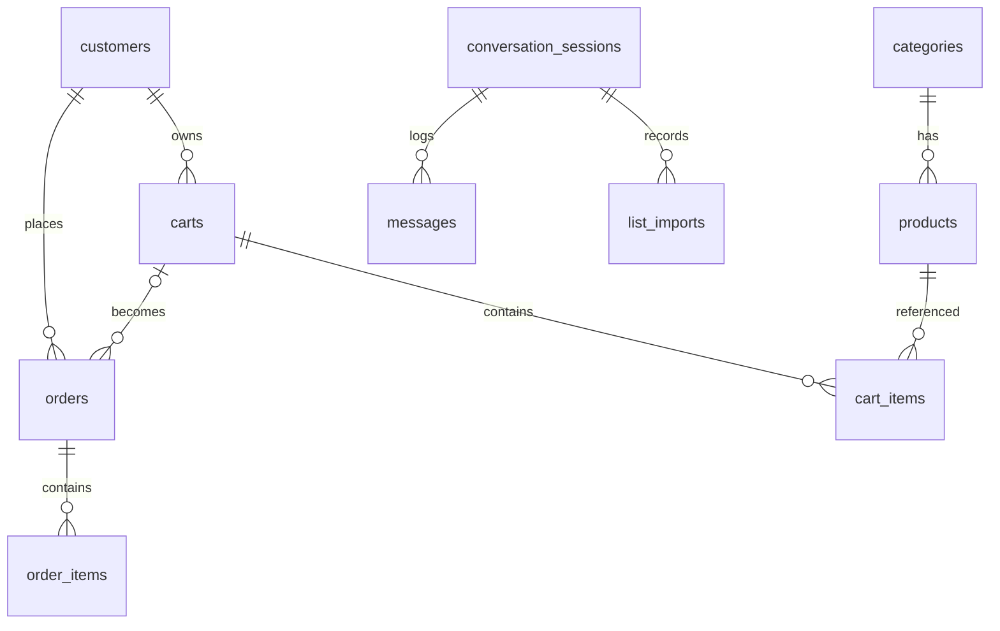

# Database — QuickCart

Postgres + Drizzle. Detalhe completo das colunas: `.specs/features/mvp/spec.md` §2.
Convenções: PK uuid v7, `varchar` no lugar de enum de banco, timestamps `timestamptz`.

## Diagrama

`geocoded_addresses` e `unmatched_demands` ficam fora do diagrama de propósito: nenhuma tem FK. A
primeira é cache global indexado por CEP; a segunda sobrevive ao cliente que originou o pedido.

## Pontos críticos

- **Extensões** (migration 0000): `pg_trgm`, `unaccent` + função `immutable_unaccent`
  (wrapper IMMUTABLE exigido pelos índices GIN de expressão).
- **Busca**: índices GIN trigram em `lower(immutable_unaccent(name))` e brand; coluna
  `aliases text[]` alimenta o matcher — enriquecer aliases é a alavanca nº 1 de qualidade
  do bot (usar `list_imports` p/ descobrir termos que os clientes usam).
- **Estoque**: decremento atômico `UPDATE ... SET stock_quantity = stock_quantity - $qty
  WHERE id = $id AND stock_quantity >= $qty` dentro da transação do pedido; 0 linhas
  afetadas → rollback + erro `ORDER_OUT_OF_STOCK`. Cancelamento devolve na mesma transação.
- **`conversation_sessions.context` (jsonb)**: carrinho de resoluções pendentes
  (`pendingResolutions: [{ originalTerm, quantity, unit, candidates: [{ productId, score }] }]`),
  paginação de browse, draft de checkout. Nunca crescer sem limpar ao trocar de estado.
- **Snapshots**: `order_items` copia `product_name` e `unit_price_in_cents` — preço de
  produto pode mudar sem afetar pedidos passados.
- **Endereço estruturado** (migration 0010): `orders.address` e `customers.default_address`
  continuam `jsonb`, mas o que é gravado agora passa por `addressSchema`
  (`modules/shared/address/`) — os dois canais produzem a mesma forma. `legacy_address_text`
  nas duas tabelas guarda o texto original de pedidos anteriores; está **vazia**, e vai
  continuar: a ADR 0001 cancelou o backfill (regex de CEP em texto livre casa com celular e
  CPF). `make address-inventory` conta as formas gravadas sem escrever nem imprimir PII.
- **Cache de geocodificação** (`geocoded_addresses`, migration 0010): CEP → coordenada, chave
  primária no CEP sem hífen. Em Postgres e não em Redis porque não expira — a rua não se move,
  e esquecer de graça devolveria a loja ao limite de 1 req/s do Nominatim. Coordenada em
  `numeric(10,7)`, nunca float.
- **`stores` não existe** (criada na 0010, removida na 0011): veio de uma premissa de
  multiempresa que este schema não tem. Endereço da loja é `STORE_CEP`/`STORE_ADDRESS` em env,
  uma loja por deployment.
- **Seeds**: exclusivamente via use-cases (`CreateCategory`/`CreateProduct`/`CreateWebOrder`) —
  proibido INSERT bruto. Os pedidos de seed usam CEPs reais em faixas de distância medidas, e a
  fila de recibo é dublada para não mandar WhatsApp a cliente fictício.
